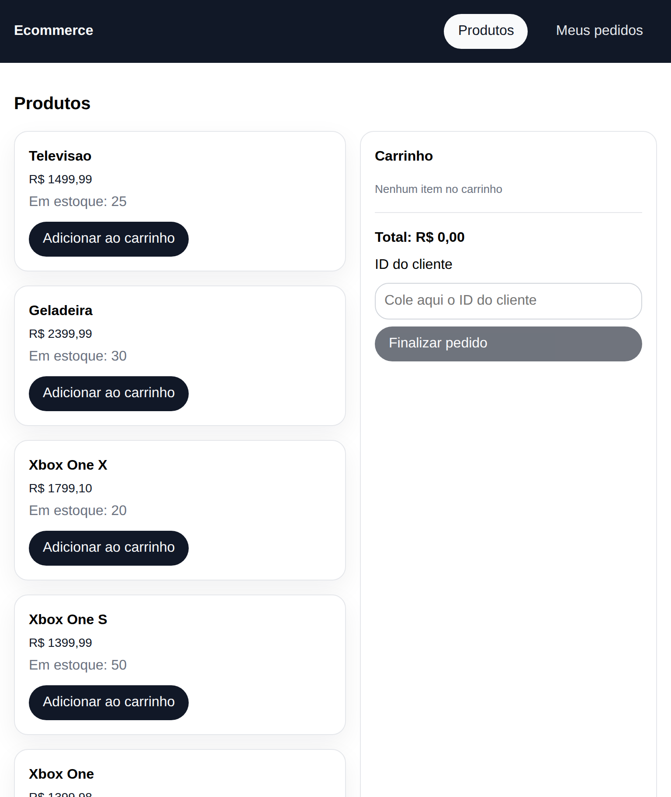
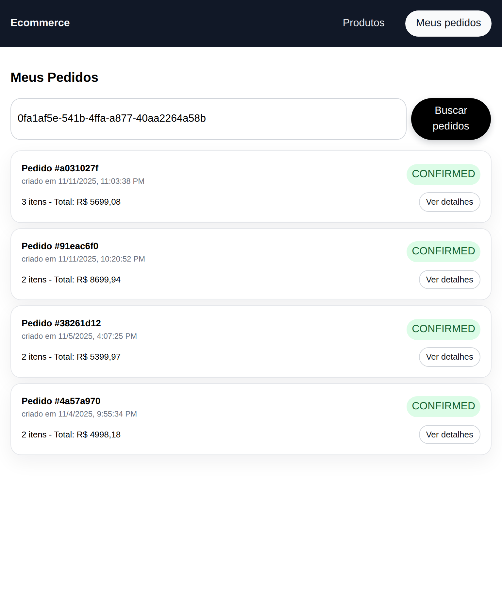
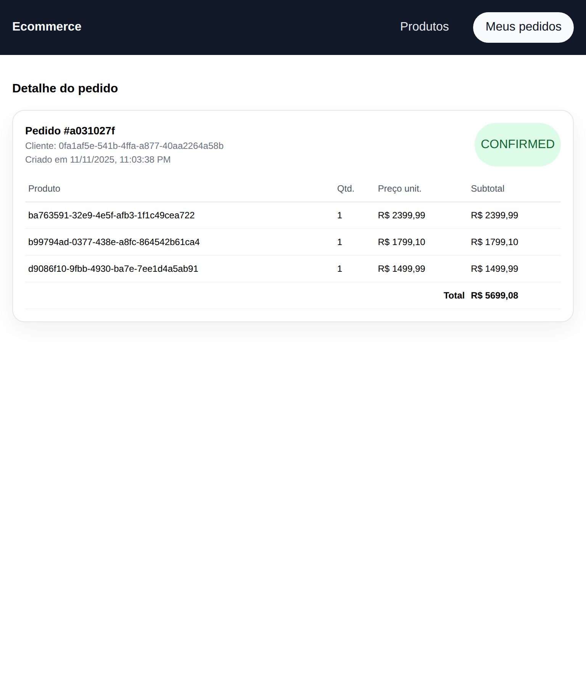

# ECOMMERCE

Aplicação que simula um Ecommerce com fluxo síncrono (API REST) utilizando Express e fluxo assíncrono (event-drive) utilzando Rabbitmq.

## Interface

|                                              |                                            |                                                    |
| -------------------------------------------- | ------------------------------------------ | -------------------------------------------------- |
|  |  |  |

## Estrutura

```bash
/ecommerce-backend
├── /src (API REST)
├── /workers
    ├── /payment-worker
    ├── /stock-worker
```

O fluxo do sistema e esse:
API REST recebe uma requisição -> se necessário, envia a mensagem para o payment-worker -> payment-worker valida pagamento, se for um sucesso, envia mensagem para stock -> valida o estoque, se estiver correto envia mensagem confirmando o pedido.

Resumido:
API REST -> payment-worker -> stock-worker

## Rotas

### Cliente

| Método     | Rota             | Descrição               |
| ---------- | ---------------- | ----------------------- |
| **GET**    | `/customers`     | Lista todos os clientes |
| **GET**    | `/customers/:id` | Exibe cliente por ID    |
| **POST**   | `/customers`     | Adicina cliente         |
| **DELETE** | `/customers/:id` | Remove cliente por ID   |

### Produto

| Método     | Rota            | Descrição               |
| ---------- | --------------- | ----------------------- |
| **GET**    | `/products`     | Lista todos os produtos |
| **GET**    | `/products/:id` | Exibe produto por ID    |
| **POST**   | `/products`     | Adicina produto         |
| **DELETE** | `/products/:id` | Remove produto por ID   |

### Pedido

| Método   | Rota                    | Descrição                       |
| -------- | ----------------------- | ------------------------------- |
| **GET**  | `/orders`               | Lista todos os pedidos          |
| **GET**  | `/orders/:id`           | Exibe pedido por ID             |
| **POST** | `/orders`               | Adicina pedido                  |
| **GET**  | `/customers/:id/orders` | Lista pedidos por ID do Cliente |

## Como Rodar o Projeto Localmente

1. Clone o projeto:

```bash
git clone https://github.com/Jonas-petty/Ecommerce.git
```

2. Inicie o Banco de Dados PostgreSQL e message broker Rabbitmq por meio do arquivo docker-compose.yml disponibilizado.

```bash
# Dentro de ecommerce-backend
docker-compose up -d
```

3. Gere todos os arquivos .env necessários baseados nos .env.template disponíveis.

```bash
cp .env.template .env
ou
touch .env
```

Nas seguintes pastas:

```bash
/ecommerce-backend

/ecommerce-backend/workers/payment-worker

/ecommerce-backend/workers/stock-worker
```

Obs: O user e password padrão do rabbitmq geralmente são `guest`

4. Iniciar a API REST

```bash
# Dentro de ecommerce-backend/src
npm install
npm run prisma:generate # Gera o prisma client
npm run prisma:migrate # Executa as migrations no banco de dados

npm run dev
```

5. Iniciar os Workers

Obs: Recomendado usar 3 terminais diferentes:

-   1 (API REST);
-   2 (payment-worker);
-   3 (stock-worker);

Payment Worker

```bash
# Dentro de ecommerce-backend/workers/payment-worker
npm install
npm run dev
```

Stock Worker

```bash
# Dentro de ecommerce-backend/workers/stock-worker
npm install
npm run dev
```

6. Testes:

Podem ser feitos utilizando Postman, Insomnia ou outro API Client de escolha.

## Ferramentas utilizadas

-   Typescript
-   Express
-   Prisma
-   Zod
-   dotenv
-   amqplib
-   cors
-   nodemon

## Objetivos Futuros:

-   Implementar Front-end
-   Subir para um servidor como Render e CloudAMQP
-   Refatorar codigo
